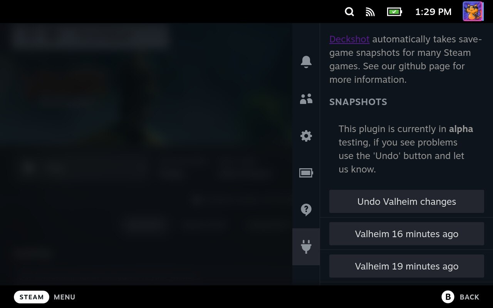
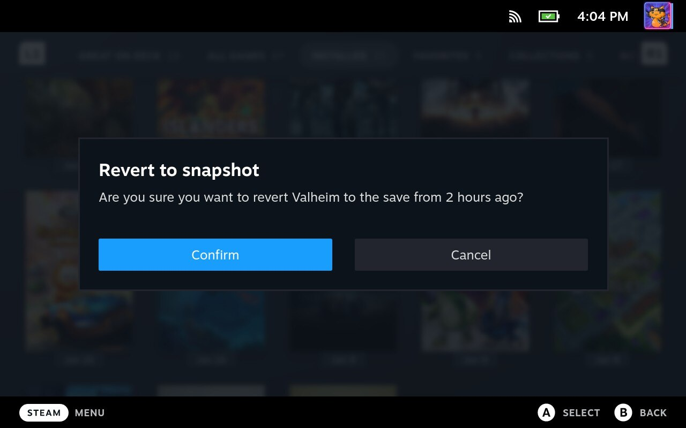
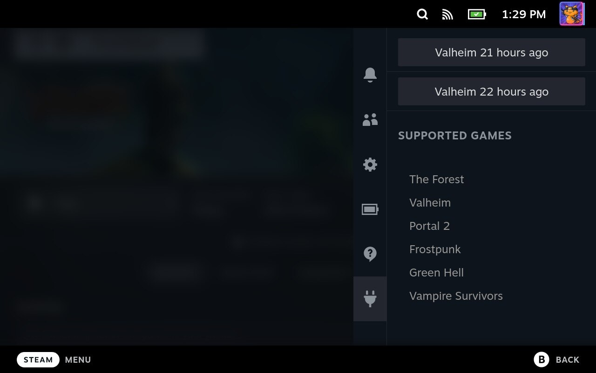

# Steamback

(This page is mostly about our Steam Deck plugin - if you are looking for the desktop version of Steamback see [here](doc/desktop.md))

Steamback is a plugin for [decky-loader](https://deckbrew.xyz/).  It adds automatic 'snapshots' of changed savegames for many (but not all - see below) 'steam cloud' enabled games.  

These snapshots allow you to 'rewind' to previous save-game versions.  This is particularly useful if your game only offers one save-game and (like me) are a poor game player and you want to rewind to the version from yesterday or last week.

This plug-in is currently in alpha-testing.  Please check for updates to the steamback plugin occasionally.  If you see bugs, please file an [issue](https://github.com/geeksville/steamback/issues) at our github.

## How automatic snapshots work

Steamback waits for games to exit.  When a (supported) game exits it automatically makes a local 'snapshot' of the save-data for that game.  The plugin keeps the ten most recent snapshots available so you can 'rewind' to a particular version of a save-game.

## How to rewind to a snapshot

To rewind to a save-game:

* Exit any running games (you can not rewind to an old save-game while that game is running)
* Press ... button
* Click the decky icon
* Click on "Steamback"
* Select which save-game you want to rewind to
* Confirm you want to revert in the confirmation dialog

Steamback will then rewind to that save game.  Also (because this plugin is still in alpha) it will create a special "undo" snapshot.  You can use this undo to revert whatever changes were made by the most recent rewind.

## What games are supported?

Not all games are supported. This plugin only supports games that use the steam 'cloud save' API.  

The plugin will show what games you have installed that **are** supported.  Most (nearly all?) games marked as 'steam cloud' enabled are supported, but if you see one that isn't please file a github issue.

## How to install Steamback

Steamback is available in the Decky loader plug-in 'store'.  You can search for it there and then click 'install'.

## How to use Steamback

The plugin will automatically take snapshots **whenever you exit a supported game**.  So if you want a snapshot, make sure to exit the game completely.  Steamback will pop up a notification in the bottom right of your screen saying "Steamback snapshot taken".

If you ever want to rewind to a particular snapshot, just click the ... button, go to decky/steamback and select which snapshot you want to rewind to.

# Are you a developer (or would you like to learn)?

We love pull-requests but please see our [requirements](doc/development.md) so your changes can be merged.

# License & credits

Steamback is Copyright 2023 Geeksville Industries, LLC.  It is open-source (GPL v3 licensed) and we welcome collaboration on our github. 

The application icon when running on desktop computers is [by Icons8](https://icons8.com/icon/J6Lv30IPIWZI/refresh) and used per their terms of use.

